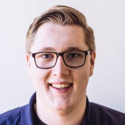

👋 We’re a tough track on web development, frontend applications, and data visualization. We’re 👩🏽‍🎓 students, 👷🏽‍♀️ industry, and 👩🏽‍🏫 teachers combined, in one location, where everyone learns. We start October 18th and end November 27th.

We work from 9:30 a.m. to 5:00 p.m, every work day, for six weeks, in a lab setting with 40 students and 2 teachers. Every 2 weeks a new course on a particular topic.

## Students

Our students already know Bash, Git, GitHub, HTML, CSS, JavaScript, databases, Node, and npm. Not only that, they’re digital designers focussed on fixing problems for actual humans.

In this track we focus on frontend frameworks, such as React and Vue, and data visualistion, mostly with D3. This enables students to make their ideas for the web into reality. Though the subject matter is technical, attention to user experience and interaction design is, as always in our programme, stressed.

## Teachers

Laurens is an all-round creative developer. He teaches at CMD Amsterdam, but also helps refugees learn new skills and prepare themselves for a new working life in CS at HackYourFuture.

 

Danny is an Indie Maker creating digital products for the web. He’s also an experienced teacher and lectures in almost every technical course at CMD Amsterdam. He coordinates Blok Tech in the second academic year.

 

Robert likes tinkering with new technology. He’s a new teacher at CMD Amsterdam and studied Information Systems at the Amsterdam university. He also does media-stuff at his own company Artaphine.

## Gallery

## Program

This track is given at CMDA, a human-centred digital design bachelor for frontend focussed students. CMD is part of the Faculty of Digital Media and Creative Industries at the Amsterdam University of Applied Sciences.
