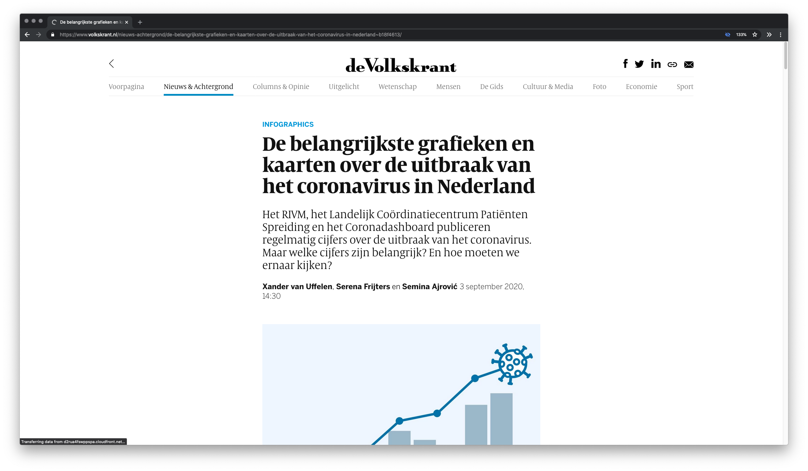

## Client

During the Tech-Track we will be working for 'De Volkskrant'. A dutch newspaper which is seen as a _quality newspaper_. Circulation of approximately 250,000 (physical). Since 2004 they have an online website where they write interactive articles and make video reports. Within the Volkskrant, the Data lab is responsible for collecting, processing, and analyzing datasets. They help journalists write articles which use data. The datalab will be our direct client this year.

## Brief

You will be working with a number of datasets to do preliminary research / exploration about a topic that journalists might write an article about. During the tech-track you will regularly have to show your work to the client. They will also give workshops on processing data into an article. 

[Here's an example of the kind of data stories they write.](https://www.volkskrant.nl/nieuws-achtergrond/corona-wereldwijd-cijfers-over-het-coronavirus-in-alle-landen-op-een-rij~b14e8079/)

## Criteria

The technical requirements for your visualization are written in the course rubrics. Additionally the client gives feedback on your concept and ideas and how you interpreted the data.
